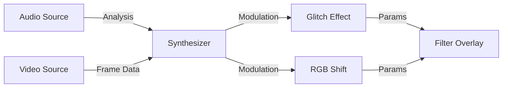

# Creative Suite Implementation Plan

This document outlines the plan for the "Creative Suite" of widgets: Filter Overlay, Effects, Synthesizer, and Sources.

## Architecture

The system uses a **Pipeline-based** architecture where data flows from Sources -> Modulators -> Effects -> Overlay.

## 1. Filter Overlay Widget (`filter-overlay`)

**Role**: The visual output layer. It covers the canvas (or part of it) and applies CSS/WebGL effects.

*   **Capabilities**:
    *   `resizable`: true (usually full screen)
    *   `zIndex`: Configurable (Background, Assets, Top)
    *   `pointerEvents`: 'none' (so clicks pass through to widgets below)
*   **Inputs**:
    *   `effect-params` (JSON object with current filter values)
*   **Implementation**:
    *   A transparent `div` with `backdrop-filter` or a WebGL canvas.
    *   Listens for `effect:update` events.

## 2. Effect Widgets

These widgets are "Logic Blocks" with a small UI. They calculate *how* the overlay should look.

### Glitch Effect (`effect-glitch`)
*   **Inputs**: `modulation` (0-1 value to control intensity).
*   **Outputs**: `effect-params` (e.g., `{ "glitchIntensity": 0.5, "sliceHeight": 10 }`).
*   **Logic**: Maps modulation input to glitch parameters.

### RGB Shift (`effect-rgb`)
*   **Inputs**: `modulation`.
*   **Outputs**: `effect-params` (e.g., `{ "rgbOffset": 5 }`).

## 3. Synthesizer Widget (`synth-master`)

**Role**: The "Brain". It takes raw data and turns it into control signals.

*   **Inputs**:
    *   `audio-analysis` (Frequency data)
    *   `video-frame` (Pixel data)
*   **Outputs**:
    *   `modulation` (Generic 0-1 control signal)
*   **UI**:
    *   Knobs for "Attack", "Decay", "Gain".
    *   Visualizer for the input signal.

## 4. Source Widgets

### Audio Player (`source-audio`)
*   **Outputs**: `audio-analysis` (FFT data array).
*   **Implementation**: Uses Web Audio API `AnalyserNode`.

### Video Player (`source-video`)
*   **Outputs**: `video-frame` (CanvasImageData or just timing info).

## Implementation Checklist

- [ ] **Create `filter-overlay`**
  - [ ] Implement `pointer-events: none` passthrough.
  - [ ] Implement `backdrop-filter` rendering.
  - [ ] Add `zIndex` layer selector (Background/Top).

- [ ] **Create `synth-master`**
  - [ ] Implement Web Audio API hooks.
  - [ ] Create UI for signal mapping.

- [ ] **Create `effect-glitch`**
  - [ ] Define the JSON schema for glitch params.

- [ ] **Create `source-audio`**
  - [ ] File upload / URL input.
  - [ ] `AnalyserNode` integration.

## Technical Notes

*   **Performance**: Streaming `audio-analysis` (60fps) via `EventBus` might be heavy.
    *   *Optimization*: Use `requestAnimationFrame` and only emit when values change significantly.
    *   *Optimization*: Use `SharedWorker` or `Transferable` objects if possible (Phase 2).
*   **Z-Index**: The `CanvasRenderer` respects `widget.zIndex`. The Overlay widget just needs a very high Z-index (e.g., 9999) to be "Top" or very low (0) to be "Background".
