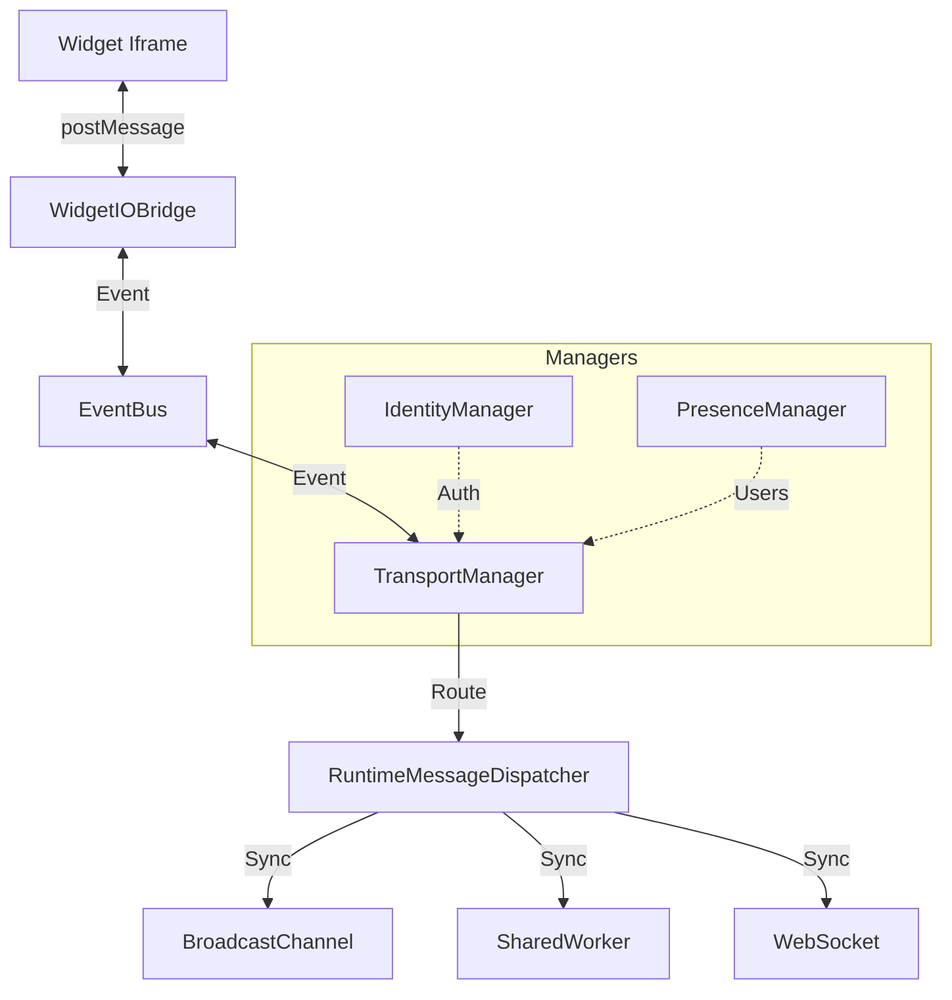

# Runtime Architecture & Debugging Guide

This document maps out the complex interactions between the runtime managers to assist in debugging.

## Core Data Flow

The system uses a **hub-and-spoke** architecture centered around the `EventBus`.

## Key Managers

### 1. TransportManager (`src/runtime/TransportManager.ts`)
**Role**: The "Router". It decides where an event should go (Local? Other Tab? Server?).
- **Input**: Events from `EventBus`.
- **Logic**: Checks `PolicyRegistry` to see if an event needs syncing.
- **Output**: Dispatches `RuntimeMessage` to the appropriate transport.

**Debugging Tip**: 
- Check `TransportManager.getDebugInfo()` in the console.
- If an event isn't syncing, check `PolicyRegistry` first.

### 2. RuntimeMessageDispatcher (`src/runtime/RuntimeMessageDispatcher.ts`)
**Role**: The "Postman". It wraps events into `RuntimeMessage` envelopes with headers (Trace IDs, Loop Protection).
- **Loop Protection**: Adds `seenBy` headers to prevent infinite loops.
- **Deduplication**: Drops messages it has already seen.

**Debugging Tip**:
- If messages are "disappearing", check the `seenBy` logs in Debug Panel. The loop detector might be too aggressive.

### 3. IdentityManager (`src/runtime/IdentityManager.ts`)
**Role**: The "Passport Office". Assigns unique IDs to the current session, tab, and user.
- **Critical**: If `IdentityManager` fails, all transports will reject messages as "unauthorized" or "invalid origin".

## Common Debugging Scenarios

### Scenario: Widget A emits event, Widget B (in another tab) doesn't see it.

1. **Check Local**: Does Widget A see its own event in the Debug Panel?
   - *No*: Issue is in `WidgetIOBridge` or `EventBus`.
   - *Yes*: Proceed to 2.

2. **Check Policy**: Is the event type configured to sync?
   - Look at `src/protocol/syncPolicies.ts`.
   - Default is usually *local only*.

3. **Check Transport**: Is `TransportManager` connected?
   - Open Debug Panel -> Transport Inspector.
   - Are `BroadcastChannel` or `SharedWorker` green?

4. **Check Dispatcher**: Did the loop detector kill it?
   - Look for "Loop detected" warnings in the console.

### Scenario: "Unauthorized" errors in console.

1. Check `IdentityManager.getCurrentIdentity()`.
2. If `userId` is missing, the `AuthContext` might not have initialized before the `RuntimeContext`.

## Visual Debugging

Use the **Debug Panel** (bottom right of the screen). It has specific inspectors for:
- **Transport**: Shows connection states.
- **Presence**: Shows who else is online.
- **Bridge**: Shows raw `postMessage` traffic.
